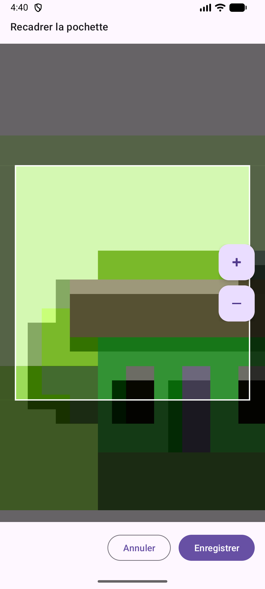

<!--suppress HtmlDeprecatedAttribute -->
<!--suppress CheckImageSize -->
<!--noinspection HtmlUnknownTarget -->
# 💿 Vinyl Collection


**Application Android** pour gérer une collection personnelle de vinyles en local avec une interface moderne Material Design 3.

> 📸 **Note** : Les captures d'écran ci-dessous sont stockées dans le répertoire `screenshots/` et sont incluses dans le repository Git.

---

## 📸 Captures d'écran

### Liste et recherche
<table>
  <tr>
    <td align="center">
      <!--noinspection HtmlUnknownTarget -->
      <br/>
      <sub><b>Liste principale</b></sub><br/>
      <sub>Affichage de la collection avec pochettes</sub>
    </td>
    <td align="center">
      <!--noinspection HtmlUnknownTarget -->
      <br/>
      <sub><b>Recherche en temps réel</b></sub><br/>
      <sub>Filtrage par titre, artiste ou genre</sub>
    </td>
    <td align="center">
      <!--noinspection HtmlUnknownTarget -->
      <br/>
      <sub><b>État vide</b></sub><br/>
      <sub>Message d'accueil si aucun vinyle</sub>
    </td>
  </tr>
</table>

### Édition et création
<table>
  <tr>
    <td align="center">
      <!--noinspection HtmlUnknownTarget -->
      <br/>
      <sub><b>Formulaire de création</b></sub><br/>
      <sub>Bottom sheet élégant</sub>
    </td>
    <td align="center">
      <!--noinspection HtmlUnknownTarget -->
      <br/>
      <sub><b>Champs de saisie</b></sub><br/>
      <sub>Titre, artiste, année, label...</sub>
    </td>
  </tr>
</table>

### Détails et interactions
<table>
  <tr>
    <td align="center">
      <!--noinspection HtmlUnknownTarget -->
      <br/>
      <sub><b>Carte vinyle</b></sub><br/>
      <sub>Affichage hiérarchisé des infos</sub>
    </td>
    <td align="center">
      <!--noinspection HtmlUnknownTarget -->
      <br/>
      <sub><b>Confirmation suppression</b></sub><br/>
      <sub>Dialog de sécurité</sub>
    </td>
    <td align="center">
      <!--noinspection HtmlUnknownTarget -->
      <br/>
      <sub><b>Prévisualisation pochette</b></sub><br/>
      <sub>Vue plein écran de la pochette</sub>
    </td>
  </tr>
  <tr>
    <td align="center">
      <!--noinspection HtmlUnknownTarget -->
      <br/>
      <sub><b>Recadrage manuel</b></sub><br/>
      <sub>Glisser et zoomer pour cadrer</sub>
    </td>
  </tr>
</table>

> 📸 **Screenshots** :
> - Les fichiers PNG du répertoire `screenshots/` sont **inclus dans le repo Git** ✅
> - Configuration `.gitignore` autorise les images du répertoire `screenshots/`
> - Pour ajouter/mettre à jour des screenshots : Consultez [`screenshots/README.md`](screenshots/README.md)
> - **Pour prendre des screenshots** : Utilisez Android Studio Device Manager ou `adb shell screencap`
> - **Pour héberger les images sur GitHub Issues** : Voir [`HOSTING_SCREENSHOTS.md`](HOSTING_SCREENSHOTS.md)

---

## ✨ Fonctionnalités

### 📋 Gestion complète
- **CRUD complet** : Créer, lire, modifier et supprimer des vinyles
- **Recherche en temps réel** : Filtrage instantané par titre, artiste ou genre
- **Auto-suggestions** : Suggestions intelligentes basées sur la collection existante
- **Compteur de collection** : Affichage du nombre de vinyles possédés dans le titre
- **État vide élégant** : Message d'accueil avec guide des fonctionnalités disponibles

### 🎨 Interface moderne
- **Material Design 3** : Design système Android le plus récent
- **Bottom Sheet** : Formulaire d'édition fluide et moderne
- **Icônes personnalisées** : Vinyles, pochettes et actions visuelles
- **Thème adaptatif** : Support du mode sombre/clair
- **Boutons d'action rapide** : FAB pour scan code-barres et scan pochette

### 📸 Gestion des pochettes
- **Photo depuis caméra** : Prendre une photo directement
- **Choix depuis galerie** : Sélectionner une image existante
- **Recadrage manuel** : Glisser et zoomer pour cadrer parfaitement la pochette
- **Cadre carré** : Format optimisé pour les pochettes de vinyles
- **Zoom interactif** : Pincer pour zoomer, glisser pour déplacer
- **Prévisualisation** : Vue plein écran de la pochette
- **Icônes compactes** : Interface épurée sans texte
- **FileProvider** : Gestion sécurisée des fichiers

### 🎯 Détails enrichis
- **Notation visuelle** : Système d'étoiles sur 5 niveaux
- **Genres prédéfinis** : Liste alphabétique de 35+ genres musicaux (Alternative, Blues, Classical, Country, Disco, EDM, Electronic, Folk, Funk, Gospel, Hard rock, Hip-hop, House, Indie, J-pop, Jazz, K-pop, Latin, Metal, Pop, Punk, R&B, Rap, Reggae, Reggaeton, Rock, Soul, Soundtrack, Techno, Trance, World...)
- **État du vinyle** : Classification par qualité (Neuf, Excellent, Très bon, Bon, Correct, Mauvais, Usé)
- **Notes personnelles** : Champ libre pour commentaires
- **Métadonnées complètes** : Titre (obligatoire), artiste (optionnel), année, label
- **Interface harmonisée** : Style uniforme pour tous les champs de saisie

### 🌐 Intégration Discogs
- **Recherche par titre** : Lancement direct depuis le champ titre
- **Recherche avancée** : Par titre et/ou artiste
- **Recherche par code-barres** : Scanner le code-barres du vinyle (via MLKit)
- **Recherche par OCR** : Scanner la pochette et extraction automatique de l'artiste et du titre (via MLKit Text Recognition)
- **Import simple** : Clic sur un résultat pour ouvrir le formulaire pré-rempli
- **Import en masse** : Sélection multiple avec appui long et importation groupée
- **Auto-complétion** : Remplissage automatique des données depuis Discogs
- **Pochettes HQ** : Téléchargement des images de couverture haute résolution
- **Affichage des covers** : Visualisation des pochettes dans les résultats de recherche
- **Chargement optimisé** : Images chargées avec Coil, cache automatique et logs détaillés
- **User-Agent optimisé** : Configuration OkHttp pour une compatibilité maximale
- **Données certifiées** : Informations community-curated et vérifiées
- **24+ millions de releases** : Couverture mondiale de tous les genres
- 📖 [Lire la documentation Discogs](DISCOGS_INTEGRATION.md)
- 🖼️ [Guide des covers Discogs](DISCOGS_COVERS_GUIDE.md)
- 🔧 [Correction images Discogs](DISCOGS_COVERS_FIX.md)
- 🛠️ [Fix des images (12/02/2026)](DISCOGS_IMAGES_FIX.md)

### 🤖 Intelligence artificielle
- **MLKit Barcode Scanning** : Détection automatique des codes-barres (EAN-13, UPC, etc.)
- **MLKit Text Recognition** : Reconnaissance optique de caractères (OCR) sur les pochettes
- **Parsing intelligent** : Extraction automatique de l'artiste et du titre depuis le texte
- **Normalisation des données** : Nettoyage et formatage automatique des résultats OCR

### 💾 Stockage et sauvegarde
- **Room Database** : Base de données locale robuste
- **Pas de connexion requise** : Fonctionne 100% hors ligne
- **Persistance des photos** : Stockage local sécurisé des pochettes
- **Export JSON** : Exporter toute la collection en JSON avec covers encodées en Base64
- **Import JSON** : Importer une collection depuis un fichier JSON
- **Partage de collection** : Partager l'export JSON par email, messaging, etc.
- **Restauration complète** : Les covers sont restaurées automatiquement lors de l'import
- **IDs uniques** : Gestion automatique des conflits d'IDs lors de l'import
- 📖 [Documentation Export/Import](BACKUP_FEATURE.md)
- 🧪 [Guide de test Import/Export](TEST_IMPORT_EXPORT.md)
- 🔧 [Fix Import Covers](FIX_IMPORT_COVERS.md)

### 🔍 Fonctionnalités de scan rapide
- **Scan code-barres** : Bouton FAB dédié pour scanner un code-barres et lancer la recherche Discogs
- **Scan pochette** : Bouton FAB dédié pour photographier une pochette et extraire les infos par OCR
- **Choix de source** : Option caméra ou galerie pour les deux types de scan
- **Recherche automatique** : Lancement automatique de la recherche Discogs après scan

---

## 🚀 Démarrer

### Prérequis
- **Android Studio** : Hedgehog (2023.1.1) ou plus récent
- **SDK Android** : API 24+ (Android 7.0) minimum
- **JDK** : 17 ou supérieur
- **Gradle** : 8.0+ (fourni avec le wrapper)

### Installation

1. **Cloner le dépôt**
   ```bash
   git clone https://github.com/votre-username/VinylCollection.git
   cd VinylCollection
   ```

2. **Ouvrir dans Android Studio**
   - `File > Open` et sélectionner le dossier du projet
   - Attendre la synchronisation Gradle

3. **Compiler et exécuter**
   ```bash
   # Mode debug
   ./gradlew :app:assembleDebug
   
   # Mode release (signé)
   ./gradlew :app:assembleRelease
   
   # Générer un bundle AAB pour le Play Store
   ./gradlew :app:bundleRelease
   ```

4. **Lancer sur émulateur/appareil**
   - Cliquer sur le bouton `Run` (▶️) dans Android Studio
   - Ou utiliser : `./gradlew :app:installDebug`

### Tests rapides
```bash
# Compiler le code Kotlin uniquement
./gradlew :app:compileDebugKotlin

# Vérifier le lint
./gradlew :app:lintDebug

# Exécuter les tests unitaires
./gradlew :app:testDebugUnitTest
```

---

## 🏗️ Architecture

### Stack technique
- **Langage** : Kotlin 2.2.10
- **UI** : XML Layouts + Material Design 3
- **Architecture** : MVVM (Model-View-ViewModel)
- **Base de données** : Room 2.8.4
- **Asynchrone** : Kotlin Coroutines + Flow
- **Injection** : ViewModel (Android Architecture Components)
- **Navigation** : Fragments + Bottom Sheet Dialog
- **Réseau** : Retrofit 2.10.0 + OkHttp 4.12.0
- **Sérialisation JSON** : Gson 2.10.1 + Moshi 1.15.2
- **Chargement d'images** : Coil 2.5.0
- **Intelligence artificielle** :
  - MLKit Text Recognition 16.0.1 (OCR)
  - MLKit Barcode Scanning 17.3.0 (codes-barres)
- **Intégrations externes** :
  - API Discogs (recherche de vinyles)
  - FileProvider (gestion sécurisée des fichiers)

### Structure du projet
```
app/src/main/
├── java/com/example/vinylcollection/
│   ├── Vinyl.kt                    # Entité Room
│   ├── VinylDao.kt                 # Data Access Object
│   ├── VinylDatabase.kt            # Configuration Room
│   ├── VinylRepository.kt          # Couche de données
│   ├── VinylViewModel.kt           # ViewModel (état UI)
│   ├── VinylAdapter.kt             # Adaptateur RecyclerView liste
│   ├── VinylListFragment.kt        # Fragment liste principale
│   ├── VinylEditBottomSheet.kt     # Bottom sheet édition/création
│   ├── VinylExportImport.kt        # Export/Import JSON avec Base64
│   ├── BackupBottomSheet.kt        # Bottom sheet sauvegarde/import
│   ├── DiscogsManager.kt           # API Discogs (recherche)
│   ├── DiscogsSearchBottomSheet.kt # Bottom sheet résultats Discogs
│   ├── DiscogsResultAdapter.kt     # Adaptateur résultats Discogs
│   ├── CoverPreviewDialogFragment.kt # Preview pochette plein écran
│   ├── CropCoverActivity.kt        # Activité de recadrage manuel
│   ├── CropImageView.kt            # ImageView tactile pour recadrage
│   ├── CropOverlayView.kt          # Overlay cadre de recadrage
│   ├── VinylApp.kt                 # Application (config Coil)
│   ├── SearchSuggestion.kt         # Suggestions de recherche
│   └── MainActivity.kt             # Activité principale
├── res/
│   ├── layout/                     # Layouts XML
│   │   ├── activity_main.xml
│   │   ├── fragment_vinyl_list.xml
│   │   ├── bottom_sheet_vinyl_edit.xml
│   │   ├── bottom_sheet_discogs_search.xml
│   │   ├── bottom_sheet_backup.xml
│   │   ├── activity_crop_cover.xml
│   │   ├── dialog_cover_preview.xml
│   │   ├── item_vinyl.xml
│   │   └── item_discogs_result.xml
│   ├── drawable/                   # Icônes vectorielles
│   │   ├── ic_vinyl.xml
│   │   ├── ic_save.xml
│   │   ├── ic_delete.xml
│   │   ├── ic_camera.xml
│   │   ├── ic_image.xml
│   │   ├── ic_barcode.xml
│   │   ├── ic_scan_cover.xml
│   │   └── ...
│   ├── values/                     # Strings, colors, styles
│   │   ├── strings.xml
│   │   ├── colors.xml
│   │   └── themes.xml
│   ├── mipmap-*/                   # Icônes de l'app
│   └── xml/                        # Config FileProvider
│       └── file_paths.xml
└── AndroidManifest.xml
```

---

## 🎨 Design

### Palette de couleurs
- **Primary Blue** : `#1976D2` - Boutons d'action principaux (Enregistrer, Import, etc.)
- **Surface** : Adaptatif selon le thème système
- **On Surface** : Texte et icônes contrastés
- **Background** : Fond d'écran adaptatif

### Composants Material 3
- **TextInputLayout** : Champs de saisie avec labels flottants
- **MaterialAutoCompleteTextView** : Listes déroulantes (genre, état)
- **RatingBar** : Notation par étoiles (style Material)
- **MaterialButton** : Boutons avec icônes et couleurs
- **IconButton** : Boutons compacts pour les actions (photo, scan)
- **FloatingActionButton (FAB)** : Boutons d'action rapide (scan code-barres, scan pochette, ajouter)
- **Card** : Cartes Material pour chaque vinyle dans la liste
- **BottomSheet** : Formulaires modaux (édition, recherche Discogs, sauvegarde)
- **RecyclerView** : Listes optimisées et performantes
- **SearchView** : Barre de recherche avec suggestions
- **CheckBox** : Sélection multiple dans les résultats Discogs

### Icônes personnalisées
- 💿 **ic_vinyl.xml** : Logo vinyle par défaut
- 💾 **ic_save.xml** : Bouton enregistrer
- 🗑️ **ic_delete.xml** : Bouton supprimer
- ❌ **ic_remove.xml** : Retirer la pochette
- 📷 **ic_camera.xml** : Prendre une photo
- 🖼️ **ic_image.xml** : Choisir depuis galerie
- 👁️ **ic_view.xml** : Voir la pochette
- 🔍 **ic_search.xml** : Rechercher
- 📊 **ic_barcode.xml** : Scanner un code-barres
- 🎨 **ic_scan_cover.xml** : Scanner une pochette (OCR)
- ➕ **ic_add.xml** : Ajouter un vinyle
- 📥 **ic_export.xml** : Exporter en JSON
- 📤 **ic_import.xml** : Importer un JSON
- 🔄 **ic_sync.xml** : Synchroniser

---

## 📱 Compatibilité

- **API minimum** : 24 (Android 7.0 Nougat)
- **API cible** : 35 (Android 15)
- **Orientations** : Portrait et paysage
- **Écrans** : Téléphones et tablettes

---

## 🔒 Permissions

```xml
<!-- Caméra (optionnelle) -->
<uses-permission android:name="android.permission.CAMERA" />
<uses-feature android:name="android.hardware.camera" android:required="false" />

<!-- Internet pour API Discogs -->
<uses-permission android:name="android.permission.INTERNET" />

<!-- Stockage interne (automatique) -->
<!-- Permissions READ/WRITE_EXTERNAL_STORAGE deprecated sur Android 13+ -->
```

> **Notes** :
> - La permission caméra est demandée à l'exécution uniquement si l'utilisateur veut prendre une photo
> - La permission Internet est requise uniquement pour la recherche Discogs
> - L'application fonctionne entièrement hors ligne (sauf recherche Discogs)
> - Les fichiers (covers, exports) sont stockés dans le stockage interne de l'app

---

## 🚀 Fonctionnalités avancées

### 📱 Scan intelligent

#### Scan de code-barres
1. Appuyer sur le bouton FAB "Code-barres" (📊) en bas à droite
2. Choisir entre caméra ou galerie
3. Scanner le code-barres du vinyle (EAN-13, UPC, etc.)
4. L'application lance automatiquement une recherche sur Discogs
5. Sélectionner le résultat pour remplir automatiquement les champs

#### Scan de pochette (OCR)
1. Appuyer sur le bouton FAB "Scan pochette" (🎨) en bas à droite
2. Choisir entre caméra ou galerie
3. Photographier la pochette du vinyle
4. L'OCR extrait automatiquement l'artiste et le titre
5. Recherche automatique sur Discogs avec les infos extraites
6. Sélectionner le résultat pour finaliser

### 🌐 Recherche Discogs

#### Depuis le formulaire
- **Recherche par titre** : Bouton "🔍 Chercher sur Discogs" sous le champ titre
- **Recherche avancée** : Combiner titre et/ou artiste pour affiner les résultats

#### Import simple
- Cliquer sur un résultat pour ouvrir le formulaire avec les données pré-remplies
- Modifier si nécessaire et enregistrer

#### Import en masse
- **Sélection multiple** : Appui long sur un résultat pour activer le mode sélection
- **Tout sélectionner** : Bouton pour sélectionner tous les résultats
- **Import groupé** : Bouton "Importer (X)" pour importer tous les vinyles sélectionnés
- Les vinyles sont ajoutés directement à la collection

### 💾 Export / Import

#### Export JSON
1. Menu (⋮) → "Sauvegardes et exports" → "📥 Exporter en JSON"
2. L'application génère un fichier JSON avec :
   - Tous les vinyles de la collection
   - Les covers encodées en Base64
   - Les métadonnées (date, nombre de vinyles)
3. Partager le fichier par email, Drive, messaging, etc.

#### Import JSON
1. Menu (⋮) → "Sauvegardes et exports" → "📤 Importer un JSON"
2. Sélectionner le fichier JSON précédemment exporté
3. L'application importe automatiquement :
   - Tous les vinyles
   - Les covers (décodées depuis Base64)
   - Les métadonnées complètes

#### Cas d'usage
- **Sauvegarde régulière** : Exporter chaque semaine/mois
- **Changement de téléphone** : Export → Transfert → Import
- **Partage de collection** : Partager avec des amis collectionneurs
- **Restauration** : Retrouver une collection après réinstallation

### 🔎 Recherche et filtrage

#### Recherche locale
- **Champ de recherche** : Icône 🔍 en haut à droite
- **Filtrage temps réel** : Par titre, artiste ou genre
- **Suggestions intelligentes** : Basées sur la collection existante
- **Effacement rapide** : Bouton ❌ pour réinitialiser

#### Auto-suggestions
- Affichage dynamique des suggestions pendant la saisie
- Tri par pertinence
- Clic sur une suggestion pour rechercher

### 📸 Gestion avancée des covers

#### Recadrage manuel
1. Ajouter une photo (caméra ou galerie)
2. L'écran de recadrage s'ouvre automatiquement
3. **Glisser** : Déplacer l'image
4. **Pincer** : Zoomer/dézoomer
5. **Boutons +/-** : Zoom précis
6. **Cadre carré** : Guide visuel pour le format pochette
7. Enregistrer pour valider

#### Prévisualisation
- Cliquer sur la pochette dans la liste
- Vue plein écran avec zoom
- Navigation intuitive

---

## 📦 APK de production

### Générer un APK signé

1. **Configurer la clé de signature** (déjà fait)
   - Fichier : `app/vinyl-release-key.jks`
   - Configuré dans `local.properties`

2. **Générer l'APK**
   ```bash
   ./gradlew :app:assembleRelease
   ```

3. **Localiser l'APK**
   ```
   app/build/outputs/apk/release/app-release.apk
   ```

4. **Ou utiliser le script**
   ```bash
   ./build-release-apk.sh
   ```

---

## 🤝 Contribution

Les contributions sont les bienvenues ! N'hésitez pas à :
- 🐛 Signaler des bugs
- 💡 Proposer des fonctionnalités
- 📝 Améliorer la documentation
- 🔧 Soumettre des pull requests

---

## 📄 Licence

Ce projet est un projet personnel éducatif.

---

## 👨‍💻 Auteur

**Laurent Mangone**

---

## 🙏 Remerciements

- **Material Design 3** par Google
- **Android Jetpack Libraries** (Room, ViewModel, Navigation, Lifecycle)
- **Kotlin Coroutines** pour la programmation asynchrone
- **Retrofit** + **OkHttp** pour les appels réseau
- **Coil** pour le chargement optimisé des images
- **Gson** + **Moshi** pour la sérialisation JSON
- **MLKit** (Text Recognition & Barcode Scanning) par Google
- **Discogs API** pour la base de données mondiale de vinyles
- **Android KTX** pour les extensions Kotlin

---

## 📚 Documentation complémentaire

- 📖 [Guide de démarrage rapide](QUICK_START.md)
- 🌐 [Documentation Discogs](DISCOGS_INTEGRATION.md)
- 💾 [Guide Export/Import JSON](BACKUP_FEATURE.md)
- 🧪 [Tests Import/Export](TEST_IMPORT_EXPORT.md)
- 📸 [Guide des captures d'écran](SCREENSHOTS_GUIDE.md)
- 🔧 [Résolution des problèmes](FINAL_RESOLUTION_ALL_ERRORS.md)

---

## 📊 Résumé technique

| Catégorie | Technologies |
|-----------|-------------|
| **Langage** | Kotlin 2.2.10 |
| **UI** | Material Design 3, XML Layouts |
| **Architecture** | MVVM (Model-View-ViewModel) |
| **Base de données** | Room 2.8.4 + SQLite |
| **Asynchrone** | Kotlin Coroutines + Flow |
| **Réseau** | Retrofit 2.10.0, OkHttp 4.12.0 |
| **Images** | Coil 2.5.0, FileProvider |
| **JSON** | Gson 2.10.1, Moshi 1.15.2 |
| **IA/ML** | MLKit Text Recognition 16.0.1, Barcode Scanning 17.3.0 |
| **API externe** | Discogs Database API |
| **Min SDK** | API 24 (Android 7.0) |
| **Target SDK** | API 35 (Android 15) |

---

## 🎯 Points forts de l'application

✅ **100% Kotlin** : Code moderne et idiomatique  
✅ **Hors ligne d'abord** : Fonctionne sans connexion Internet  
✅ **Material Design 3** : Interface moderne et élégante  
✅ **IA intégrée** : OCR et détection de codes-barres  
✅ **Base de données mondiale** : 24+ millions de vinyles via Discogs  
✅ **Export/Import complet** : Sauvegarde avec covers en Base64  
✅ **Performance optimisée** : Cache d'images, coroutines, Room  
✅ **Gestion avancée des photos** : Recadrage, zoom, prévisualisation  
✅ **Recherche intelligente** : Suggestions en temps réel  
✅ **Open Source** : Code disponible et documenté

---

<div align="center">
  Made with ❤️ and 💿
</div>
