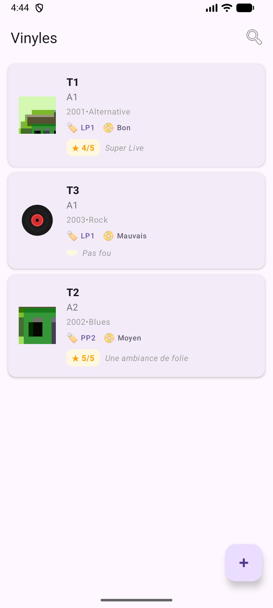
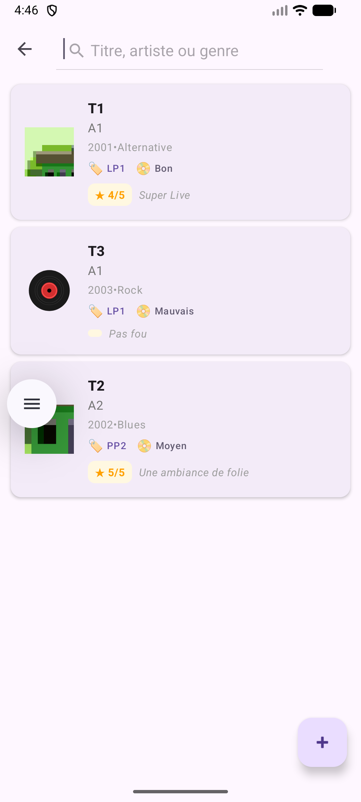
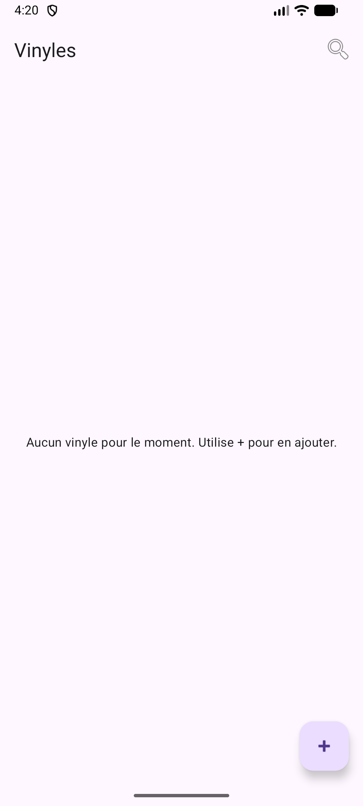
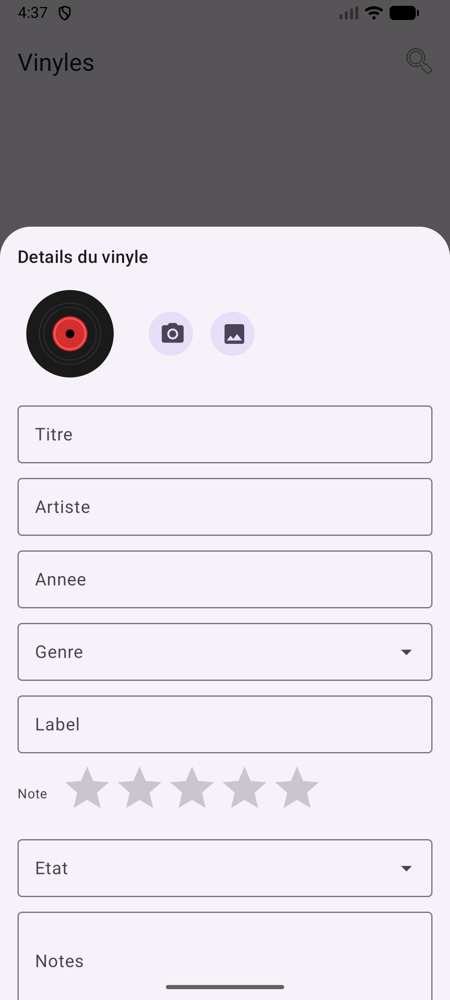
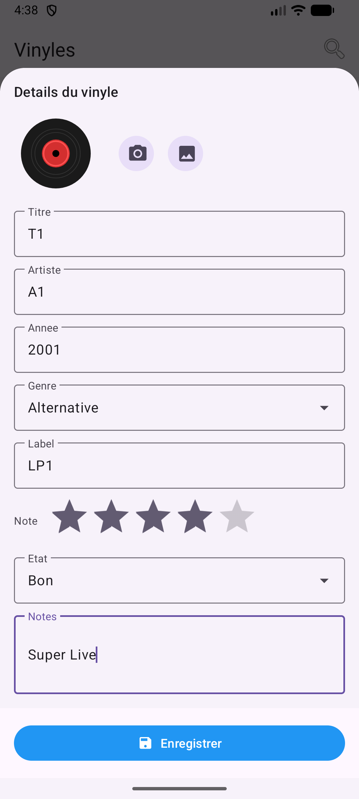
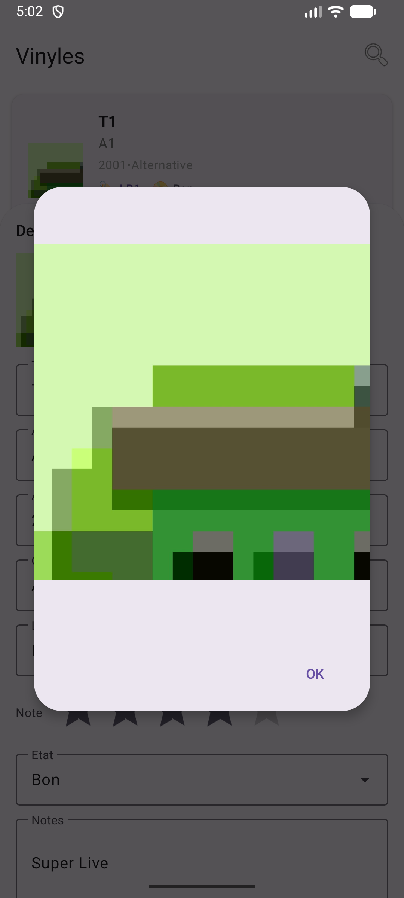

<!--suppress HtmlDeprecatedAttribute -->
<!--suppress CheckImageSize -->
<!--noinspection HtmlUnknownTarget -->
# 💿 Vinyl Collection


**Application Android** pour gérer une collection personnelle de vinyles en local avec une interface moderne Material Design 3.

---

## 📸 Captures d'écran

### Liste et recherche
<table>
  <tr>
    <td align="center">
      <!--noinspection HtmlUnknownTarget -->
      <br/>
      <sub><b>Liste principale</b></sub><br/>
      <sub>Affichage de la collection avec pochettes</sub>
    </td>
    <td align="center">
      <!--noinspection HtmlUnknownTarget -->
      <br/>
      <sub><b>Recherche en temps réel</b></sub><br/>
      <sub>Filtrage par titre ou artiste</sub>
    </td>
    <td align="center">
      <!--noinspection HtmlUnknownTarget -->
      <br/>
      <sub><b>État vide</b></sub><br/>
      <sub>Message d'accueil si aucun vinyle</sub>
    </td>
  </tr>
</table>

### Édition et création
<table>
  <tr>
    <td align="center">
      <!--noinspection HtmlUnknownTarget -->
      <br/>
      <sub><b>Formulaire de création</b></sub><br/>
      <sub>Bottom sheet élégant</sub>
    </td>
    <td align="center">
      <!--noinspection HtmlUnknownTarget -->
      <br/>
      <sub><b>Champs de saisie</b></sub><br/>
      <sub>Titre, artiste, année, label...</sub>
    </td>
    <td align="center">
      <!--noinspection HtmlUnknownTarget -->
      <br/>
      <sub><b>Gestion de la pochette</b></sub><br/>
      <sub>Icônes compactes (caméra/galerie)</sub>
    </td>
  </tr>
</table>

### Fonctionnalités avancées
<table>
  <tr>
    <td align="center">
      <!--noinspection HtmlUnknownTarget -->
      <br/>
      <sub><b>Notation par étoiles</b></sub><br/>
      <sub>Système visuel sur 5 étoiles</sub>
    </td>
    <td align="center">
      <!--noinspection HtmlUnknownTarget -->
      <br/>
      <sub><b>Sélection du genre</b></sub><br/>
      <sub>Liste déroulante de 35+ genres</sub>
    </td>
    <td align="center">
      <!--noinspection HtmlUnknownTarget -->
      <br/>
      <sub><b>État du vinyle</b></sub><br/>
      <sub>Bon / Moyen / Mauvais</sub>
    </td>
  </tr>
</table>

### Détails et interactions
<table>
  <tr>
    <td align="center">
      <!--noinspection HtmlUnknownTarget -->
      <br/>
      <sub><b>Carte vinyle</b></sub><br/>
      <sub>Affichage hiérarchisé des infos</sub>
    </td>
    <td align="center">
      <!--noinspection HtmlUnknownTarget -->
      <br/>
      <sub><b>Confirmation suppression</b></sub><br/>
      <sub>Dialog de sécurité</sub>
    </td>
    <td align="center">
      <!--noinspection HtmlUnknownTarget -->
      <br/>
      <sub><b>Prévisualisation pochette</b></sub><br/>
      <sub>Vue plein écran de la pochette</sub>
    </td>
  </tr>
</table>

> **📌 Note sur les screenshots** :
> - Les screenshots ne sont **pas inclus dans le repo Git** pour éviter d'alourdir le dépôt
> - **Pour prendre des screenshots** : Consultez le guide [`SCREENSHOTS_GUIDE.md`](SCREENSHOTS_GUIDE.md)
> - **Scripts automatiques disponibles** :
>   - `./take-screenshot.sh <nom>` - Prendre un screenshot individuel via ADB
>   - `./capture-all-screenshots.sh` - Guide interactif pour capturer les 12 screenshots
> - **Pour héberger les images sur GitHub** : Voir [`HOSTING_SCREENSHOTS.md`](HOSTING_SCREENSHOTS.md)
> - **Statut actuel** : Consultez [`screenshots/PLACEHOLDER.md`](screenshots/PLACEHOLDER.md)

---

## ✨ Fonctionnalités

### 📋 Gestion complète
- **CRUD complet** : Créer, lire, modifier et supprimer des vinyles
- **Recherche en temps réel** : Filtrage instantané par titre ou artiste
- **État vide élégant** : Message d'accueil quand la collection est vide

### 🎨 Interface moderne
- **Material Design 3** : Design système Android le plus récent
- **Bottom Sheet** : Formulaire d'édition fluide et moderne
- **Icônes personnalisées** : Vinyles, pochettes et actions visuelles
- **Thème adaptatif** : Support du mode sombre/clair

### 📸 Gestion des pochettes
- **Photo depuis caméra** : Prendre une photo directement
- **Choix depuis galerie** : Sélectionner une image existante
- **Recadrage automatique** : Format carré pour les pochettes
- **Prévisualisation** : Vue plein écran de la pochette
- **Icônes compactes** : Interface épurée sans texte

### 🎯 Détails enrichis
- **Notation visuelle** : Système d'étoiles sur 5 niveaux
- **Genres prédéfinis** : Liste de 35+ genres musicaux (Pop, Rock, Jazz, Hip-hop, EDM...)
- **État du vinyle** : Classification (Bon / Moyen / Mauvais)
- **Notes personnelles** : Champ libre pour commentaires
- **Métadonnées complètes** : Titre, artiste, année, label

### 💾 Stockage local
- **Room Database** : Base de données locale robuste
- **Pas de connexion requise** : Fonctionne 100% hors ligne
- **Persistance des photos** : Stockage local sécurisé des pochettes

---

## 🚀 Démarrer

### Prérequis
- **Android Studio** : Hedgehog (2023.1.1) ou plus récent
- **SDK Android** : API 24+ (Android 7.0) minimum
- **JDK** : 17 ou supérieur
- **Gradle** : 8.0+ (fourni avec le wrapper)

### Installation

1. **Cloner le dépôt**
   ```bash
   git clone https://github.com/votre-username/VinylCollection.git
   cd VinylCollection
   ```

2. **Ouvrir dans Android Studio**
   - `File > Open` et sélectionner le dossier du projet
   - Attendre la synchronisation Gradle

3. **Compiler et exécuter**
   ```bash
   # Mode debug
   ./gradlew :app:assembleDebug
   
   # Mode release (signé)
   ./gradlew :app:assembleRelease
   
   # Générer un bundle AAB pour le Play Store
   ./gradlew :app:bundleRelease
   ```

4. **Lancer sur émulateur/appareil**
   - Cliquer sur le bouton `Run` (▶️) dans Android Studio
   - Ou utiliser : `./gradlew :app:installDebug`

### Tests rapides
```bash
# Compiler le code Kotlin uniquement
./gradlew :app:compileDebugKotlin

# Vérifier le lint
./gradlew :app:lintDebug

# Exécuter les tests unitaires
./gradlew :app:testDebugUnitTest
```

---

## 🏗️ Architecture

### Stack technique
- **Langage** : Kotlin 2.1.0
- **UI** : XML Layouts + Material Design 3
- **Architecture** : MVVM (Model-View-ViewModel)
- **Base de données** : Room 2.6.1
- **Asynchrone** : Kotlin Coroutines + Flow
- **Injection** : ViewModel (Android Architecture Components)
- **Navigation** : Fragments + Bottom Sheet Dialog

### Structure du projet
```
app/src/main/
├── java/com/example/vinylcollection/
│   ├── Vinyl.kt                    # Entité Room
│   ├── VinylDao.kt                 # Data Access Object
│   ├── VinylDatabase.kt            # Configuration Room
│   ├── VinylRepository.kt          # Couche de données
│   ├── VinylViewModel.kt           # ViewModel (état UI)
│   ├── VinylAdapter.kt             # Adaptateur RecyclerView
│   ├── VinylListFragment.kt        # Fragment liste
│   ├── VinylEditBottomSheet.kt     # Bottom sheet édition
│   ├── CoverPreviewDialogFragment.kt # Preview pochette
│   └── MainActivity.kt             # Activité principale
├── res/
│   ├── layout/                     # Layouts XML
│   ├── drawable/                   # Icônes vectorielles
│   ├── values/                     # Strings, colors, styles
│   ├── mipmap-*/                   # Icônes de l'app
│   └── xml/                        # Config FileProvider
└── AndroidManifest.xml
```

---

## 🎨 Design

### Palette de couleurs
- **Primary Blue** : `#1976D2` - Bouton Enregistrer
- **Surface** : Adaptatif selon le thème système
- **On Surface** : Texte et icônes contrastés

### Composants Material 3
- **TextInputLayout** : Champs de saisie avec labels flottants
- **MaterialAutoCompleteTextView** : Listes déroulantes (genre, état)
- **RatingBar** : Notation par étoiles
- **MaterialButton** : Boutons avec icônes
- **IconButton** : Boutons compacts pour les actions (photo)
- **Card** : Cartes pour chaque vinyle dans la liste
- **BottomSheet** : Formulaire d'édition modal

### Icônes personnalisées
- 💿 **ic_vinyl.xml** : Logo vinyle par défaut
- 💾 **ic_save.xml** : Bouton enregistrer
- 🗑️ **ic_delete.xml** : Bouton supprimer
- ❌ **ic_remove.xml** : Retirer la pochette
- 📷 **ic_camera.xml** : Prendre une photo
- 🖼️ **ic_image.xml** : Choisir depuis galerie
- 👁️ **ic_view.xml** : Voir la pochette

---

## 📱 Compatibilité

- **API minimum** : 24 (Android 7.0 Nougat)
- **API cible** : 35 (Android 15)
- **Orientations** : Portrait et paysage
- **Écrans** : Téléphones et tablettes

---

## 🔒 Permissions

```xml
<!-- Caméra (optionnelle) -->
<uses-permission android:name="android.permission.CAMERA" />
<uses-feature android:name="android.hardware.camera" android:required="false" />

<!-- Stockage interne (automatique) -->
```

> La permission caméra est demandée à l'exécution uniquement si l'utilisateur veut prendre une photo.

---

## 📦 APK de production

### Générer un APK signé

1. **Configurer la clé de signature** (déjà fait)
   - Fichier : `app/vinyl-release-key.jks`
   - Configuré dans `local.properties`

2. **Générer l'APK**
   ```bash
   ./gradlew :app:assembleRelease
   ```

3. **Localiser l'APK**
   ```
   app/build/outputs/apk/release/app-release.apk
   ```

4. **Ou utiliser le script**
   ```bash
   ./build-release-apk.sh
   ```

---

## 🤝 Contribution

Les contributions sont les bienvenues ! N'hésitez pas à :
- 🐛 Signaler des bugs
- 💡 Proposer des fonctionnalités
- 📝 Améliorer la documentation
- 🔧 Soumettre des pull requests

---

## 📄 Licence

Ce projet est un projet personnel éducatif.

---

## 👨‍💻 Auteur

**Laurent Mangone**

---

## 🙏 Remerciements

- Material Design 3 par Google
- Android Jetpack Libraries
- Kotlin Coroutines

---

<div align="center">
  Made with ❤️ and 💿
</div>
